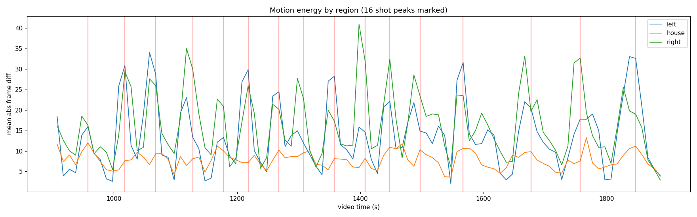

# curling-video-ml

ML/CV analysis of curling livestreams. Long-term vision: auto-track shot types per
team, break down make percentages by scenario, measure time-per-shot, etc.

**Current milestone:** detect the beginning and end of every shot in a game.

Test video: https://www.youtube.com/watch?v=a2EJcV29ido
("6/8 - Sheet 1 - Spring Monday Open League 2026"), focusing on the end at
**15:22 – 30:58** for prototyping.

## Findings so far (proof of concept)

The stream is a fixed-layout composite of three views:

| Region | Content |
|---|---|
| Left panel (~0–42% of width) | Down-ice camera, one end |
| Center strip (~42–58%) | Two stacked overhead house cams |
| Right panel (~58–100%) | Down-ice camera, other end |

A red wall-clock timestamp is burned into the bottom-left corner.

Even using only YouTube's **storyboard preview frames** (320x180, one frame every
~9.9 s — see "environment limitation" below), simple per-region frame differencing
resolves the shot cadence clearly. Peak detection on the combined left+right camera
motion signal over 15:22–30:58 finds **exactly 16 bursts** — the expected 16 shots
of a full end — with a plausible rhythm: ~50–60 s between shots early in the end,
stretching to 70–110 s for the final (skip) stones.



See `results/shots_storyboard.csv` for the detected shot times.

This strongly suggests that with the real video (e.g. 480p @ 30fps, sampled at a
few fps) we can detect shot start/end boundaries precisely: shot start = motion
burst begins in the delivery-end camera, shot end = motion settles in the house cam.

## Pipeline

```
scripts/download.sh          # yt-dlp invocation that works for this stream
src/extract_storyboard.py    # storyboard .mhtml -> timestamped frame tiles
src/analyze_storyboard.py    # tiles -> motion signal -> shot peaks (coarse, ~10s)
src/detect_shots.py          # full video -> precise shot start/end segments (CSV)
```

### Coarse storyboard analysis (works anywhere, reproducible from checked-in data)

```bash
pip install -r requirements.txt
python src/extract_storyboard.py data/storyboard.mhtml --out data/sb_tiles
python src/analyze_storyboard.py data/sb_tiles --start 922 --end 1858 --out results/
```

### Full-resolution detection (needs the actual video)

```bash
./scripts/download.sh                       # or download manually with yt-dlp
python src/detect_shots.py data/end_test.mp4 --plot --out results/shots.csv
```

`detect_shots.py` samples the video at ~4 fps, computes motion energy in the three
camera regions, and segments shots with hysteresis thresholding (a shot is "active"
while motion stays elevated; boundaries are walked out to the quiet baseline).

## Environment limitation (why storyboards?)

This repo was bootstrapped in a cloud sandbox whose egress proxy presents different
client IPs to youtube.com and googlevideo.com. YouTube binds stream URLs to the
requesting IP, so every actual video download 403s here, regardless of player
client / PO token / JS-challenge setup (all of which were configured and working —
see `scripts/download.sh`). Only the storyboard images were downloadable, so the
proof of concept uses those. Run the download on a normal residential connection
and everything in `detect_shots.py` applies to the real frames.

## Next steps

- [ ] Run `detect_shots.py` on the real 15:22–30:58 clip; hand-label ground truth
      shot boundaries and measure precision/recall of the segmentation.
- [ ] Use the overhead house cams to detect "all rocks stopped" for precise shot end.
- [ ] OCR the burned-in clock to make timing robust to stream gaps.
- [ ] Classify which end is delivering (left vs right panel motion) -> alternating
      team attribution.
- [ ] Stone detection/tracking in the house cam -> shot type + make/miss inference.
